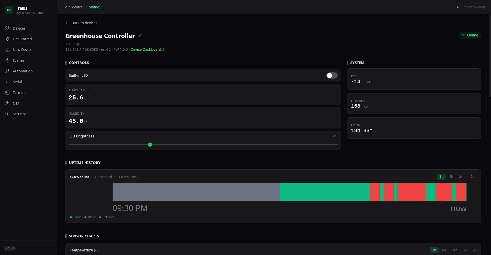
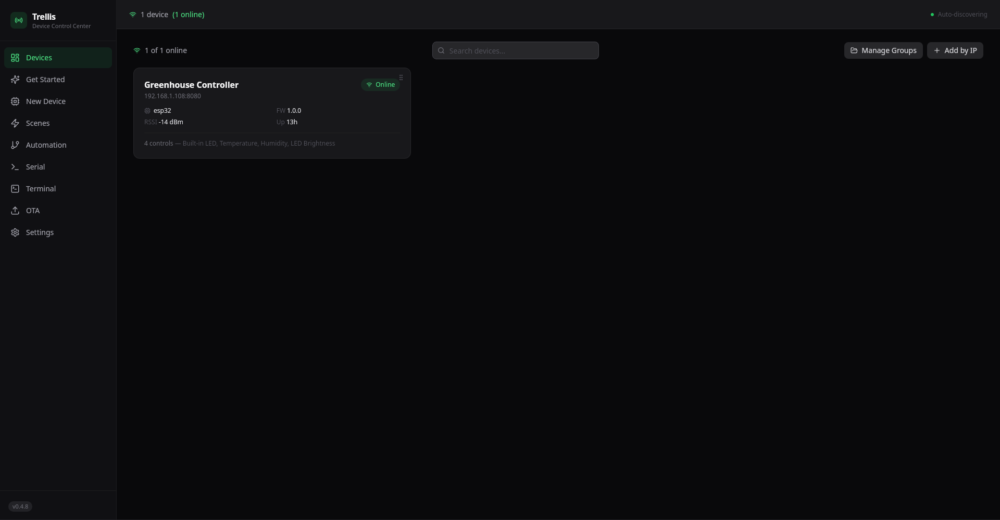
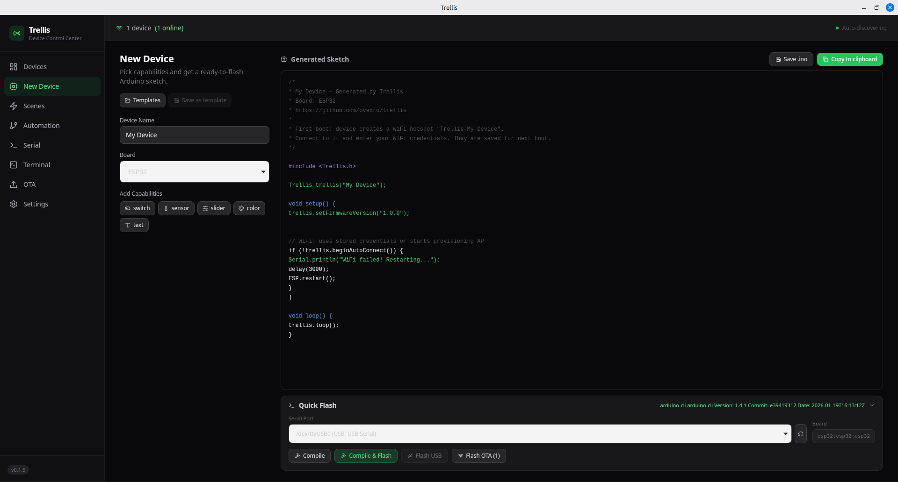
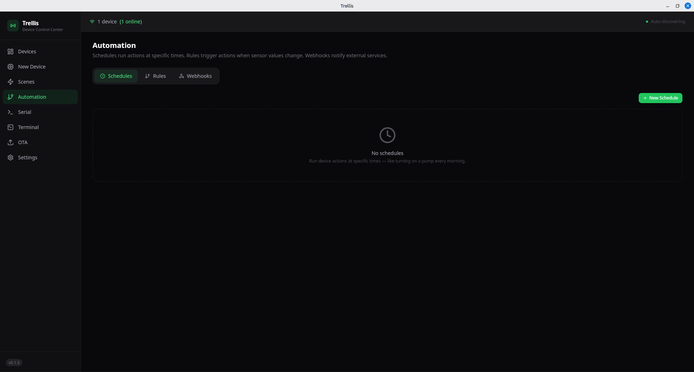
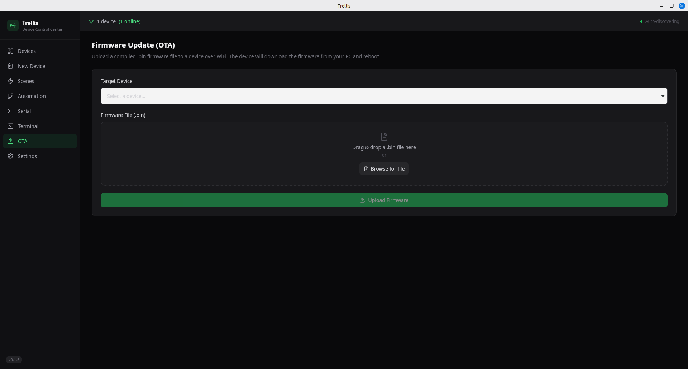
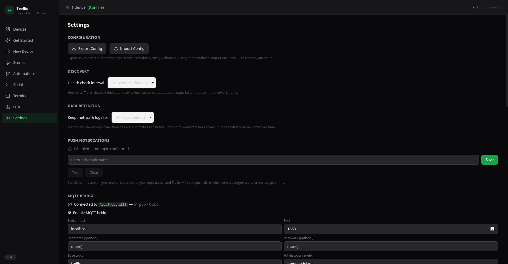
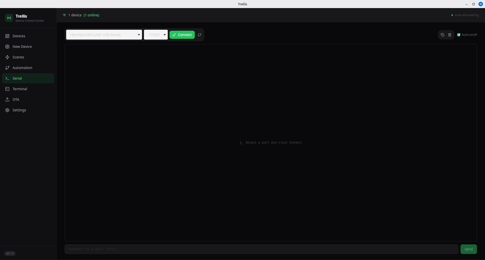

# Trellis

**The easiest way to deploy and control ESP32 and Pico W devices.**

Trellis is a desktop app + microcontroller library that makes your boards feel like real products. Plug in a device, it appears in the app, and you get auto-generated controls — no config files, no cloud, no YAML.

> **No cloud.** No account. No subscription. Your data never leaves your network.
> **No config.** Devices describe themselves. Controls render automatically.
> **No complexity.** One command to install. 15 lines to integrate.
>
> Read the full story: **[What is Trellis?](ABOUT.md)** | **[User Guide](docs/guide.md)**



## How it works

1. Drop the Trellis library into your Arduino sketch
2. Declare what your device can do (switches, sensors, sliders)
3. Open the Trellis desktop app — your device appears automatically
4. Control it, monitor it, update its firmware — all from one place

```cpp
#include <Trellis.h>

Trellis trellis("Greenhouse Controller");

void setup() {
  trellis.addSwitch("pump", "Water Pump", 13);
  trellis.addSensor("temp", "Temperature", "C");
  trellis.addSlider("fan", "Fan Speed", 0, 100, 25);
  trellis.begin("MyWiFi", "password");
}

void loop() {
  trellis.setSensor("temp", readDHT());
  trellis.loop();
}
```

The desktop app discovers your device via mDNS, reads its capability declaration, and renders the right controls — toggle for the pump, gauge for temperature, slider for fan speed.

## Install

### Linux (one command)

```bash
curl -fsSL https://raw.githubusercontent.com/ovexro/trellis/main/install.sh | bash
```

Works on Ubuntu, Linux Mint, Debian, Fedora, Arch, and derivatives. Installs dependencies, downloads the app, creates a desktop entry, and optionally installs Arduino CLI.

### Manual download

Download from [GitHub Releases](https://github.com/ovexro/trellis/releases):
- **Ubuntu/Mint/Debian** → `.deb`
- **Fedora/RHEL** → `.rpm`
- **Any Linux** → `.AppImage`

## Features

### Desktop App
- **Auto-discovery** — continuous mDNS scanning, devices appear automatically
- **Live updates** — persistent WebSocket connections, real-time sensor data
- **Device cards** — name, status, RSSI, uptime, firmware version, chip
- **Auto-generated controls** — switches, sliders, sensors, color pickers, text
- **Time-series charts** — sensor data over time with SQLite storage
- **Serial monitor** — full USB serial terminal with live streaming
- **OTA updates** — native file picker, local HTTP firmware server
- **Device persistence** — nicknames, tags, known devices survive restarts
- **Search & filter** — find devices by name, IP, platform, chip
- **Device logs** — severity-filtered log viewer with live streaming
- **Alert rules** — configurable thresholds with desktop notifications
- **System tray** — app runs in background, click to restore
- **Dark theme** — clean, modern UI with green accent

### Microcontroller Library
- **ESP32** — all variants (S2, S3, C3, C6)
- **Raspberry Pi Pico W / Pico 2 W** — full support
- **15 lines to integrate** — drop-in library, minimal boilerplate
- **Self-description protocol** — device declares its own capabilities
- **WebSocket** — real-time bidirectional communication
- **Live broadcasts** — periodic sensor values + system telemetry
- **Device logging** — logInfo()/logWarn()/logError() sent to desktop app
- **OTA ready** — firmware updates from the desktop app (ESP32)
- **System metrics** — RSSI, free heap, uptime reported automatically

## Screenshots

| | |
|---|---|
|  |  |
|  |  |
|  |  |

## Architecture

```
trellis/
├── app/          # Tauri 2 desktop app (Rust + React)
├── library/      # Arduino library (ESP32 + Pico W)
└── docs/         # Protocol spec + guides
```

**Desktop App**: Tauri 2 (Rust backend + React frontend). Local-first, no cloud dependency. SQLite for device history and metrics.

**Library**: Arduino-compatible C++ library. Works on ESP32 and Pico W/Pico 2 W with the same sketch. Handles WiFi, mDNS, HTTP, WebSocket, OTA internally.

**Protocol**: Devices serve a JSON capability declaration at `/api/info` and communicate in real-time over WebSocket. The app renders controls based on what the device reports.

## Supported Boards

| Board | Status |
|-------|--------|
| ESP32 (all variants) | Supported |
| Raspberry Pi Pico W | Supported |
| Raspberry Pi Pico 2 W | Supported |
| ESP8266 | Planned |

## Tech Stack

- **App backend**: Rust (Tauri 2)
- **App frontend**: React, TypeScript, Tailwind CSS
- **App database**: SQLite
- **Library**: C++ (Arduino framework)
- **Discovery**: mDNS / DNS-SD
- **Communication**: HTTP + WebSocket
- **Build**: Vite, Cargo

## Development

See [CONTRIBUTING.md](CONTRIBUTING.md) for setup instructions.

## Support

If you find Trellis useful, consider supporting development:

[](https://www.paypal.com/paypalme/ovexro)

## License

[MIT](LICENSE) — Joshua-Ovidiu Drobota
